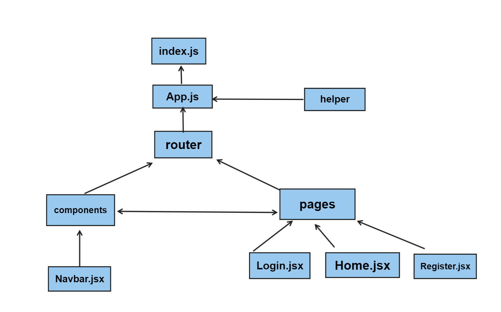

### 🚩DESCRIPTION

🔓 Login Pages:

Email and password are validated on the login page. When the user logs in, they are directed to the product page.

📖 Home Page:

Card => like💗 - camera - firstname - lastname - avatar - image - decription


🔍 Register pages
firstname lastname email phoneNumber password uploadImage 

### 🚩 PROJECT STRUCTURE

```js
├── components
│   ├── Navbar.jsx
├── package-lock.json
├── package.json
├── pages
│   ├── Login.jsx
│   ├── Register.jsx
│   ├── Home.js
│   ├── 
├── index.js
│   
├── App.js 
│   
├── Router
│   ├── AppRouter.jsx
│   └── PrivateRouter.jsx

```

### 🚩 Libraries and Technologies I use

- React.js
- Bootstrap
- Toastify
- MUI
- CSS
- Storages


### 🚩 How does my project look

<p align="left">
  
  
</p>


### 🚩 How To Use

## Getting Started with Create React App

### `yarn create react-app alpata-task`

### `yarn start`

Open [http://localhost:3000](http://localhost:3000) to view it in your browser.

```


